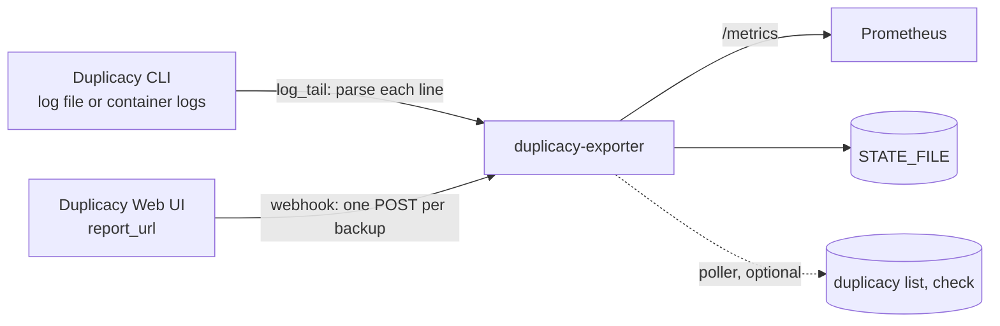

# How it works

The exporter has two inputs and one output. The output is `/metrics` on port 9750, which Prometheus scrapes.
The inputs are a Duplicacy CLI log, parsed line by line, or the JSON report the Duplicacy Web UI posts to
`report_url` when a backup ends.

## Log tail mode

`MODE=log_tail` reads either a file (`LOG_FILE`) or a container's log stream through the Docker socket
(`DOCKER_CONTAINER_NAME`). The parser tracks one backup or prune at a time:

1. A section header, `--- Backup -> Primary (<snapshot id>) ---` or `--- Prune Primary ---`, opens a run and
   sets the snapshot id. `DUPLICACY_META snapshot_id=... machine=...` lines, written by
   [duplicacy-cli-cron](https://github.com/GeiserX/duplicacy-cli-cron), set the labels directly.
2. `Storage set to <url>` sets the storage target label (the host part of the URL, mapped through
   `STORAGE_HOST_MAP` and `TAILSCALE_DOMAIN`) and turns `duplicacy_backup_running` on.
3. Every `Uploaded chunk` or `Skipped chunk` line updates progress, speed and the chunk counters.
4. `Backup for <path> at revision <n> completed` closes the run: exit code 0, revision, success timestamp.
   The `Files:`, `All chunks:` and `Total running time:` lines that follow fill the summary series. A line
   containing `Backup failed` closes it with exit code 1.
5. In a prune section, `All fossil collections have been removed` (or `no snapshot to delete`, `nothing to
   prune`) sets the prune success timestamp.

A plain `duplicacy backup` log has no section header, so nothing opens a run: the summary lines still
resolve when `SNAPSHOT_ID` and `MACHINE_NAME` are set, but the live series stay at zero.

With the Docker socket, the exporter replays the last `REPLAY_HOURS` of log on start and remembers the last
line's timestamp in `TIMESTAMP_FILE`, so a restart does not count a run twice. A run that ended more than
`REPLAY_HOURS` before the restart is outside the replay and is not read again; the saved summary of the last
completed run still serves its values.

## Webhook mode

`MODE=webhook` accepts the Web UI's report on `WEBHOOK_PATH` (`/webhook`). The report is one flat JSON object
sent only when a backup ends, so there are no live values. The snapshot id is the last path component of the
report's `directory` (the report has no id field), the machine is `computer`, and the storage target is the
host of `storage`. The fields are on [Webhook payload](webhook.md).

## What is kept across restarts

The last completed values (the `duplicacy_backup_last_*`, prune, poller and counter series) are written to
`STATE_FILE` every `PERSIST_INTERVAL` seconds when they change, and restored before the first scrape after a
restart. The live series (`running`, `progress`, `speed`, the chunk counters) are not, because they describe
a run that is no longer in flight. See [Persistence across restarts](configuration.md#persistence-across-restarts).

## The image

`drumsergio/duplicacy-exporter` is `python:3.14-alpine` plus `prometheus_client` and the duplicacy CLI 3.2.5
binary, which only the optional [storage poller](storage-poller.md) uses. It is about 39 MB compressed, for
amd64 and arm64, and runs as root by default (the Docker socket needs it; set `user:` if you tail a file).
