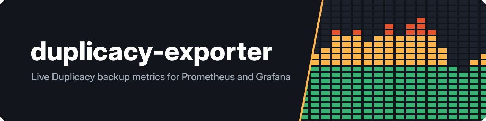
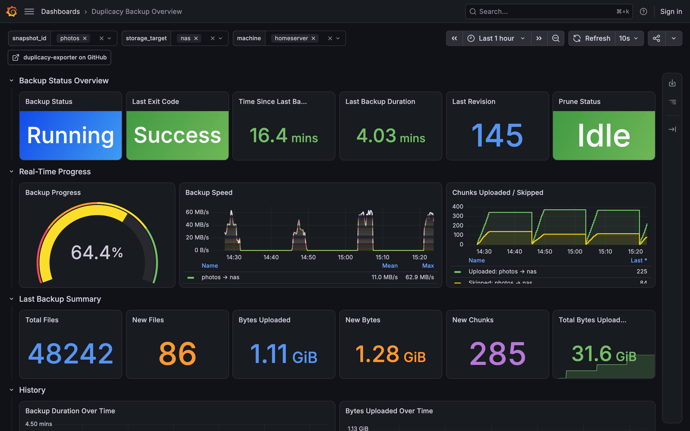
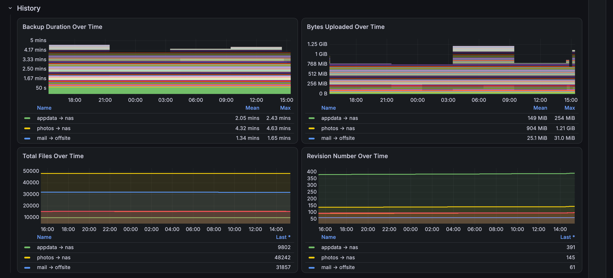
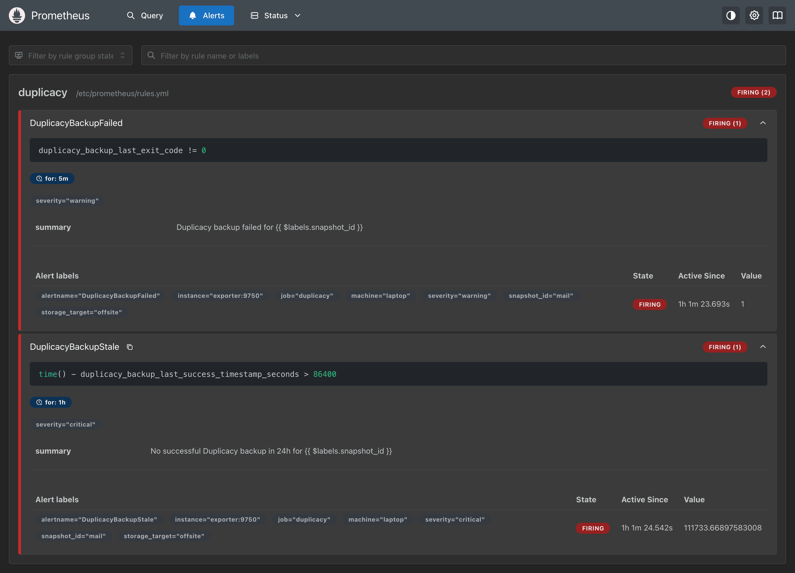
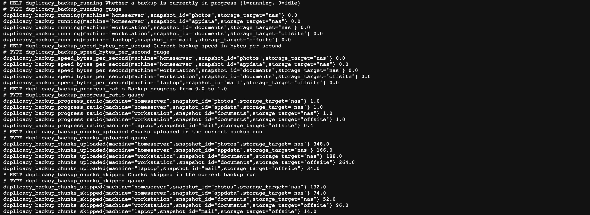
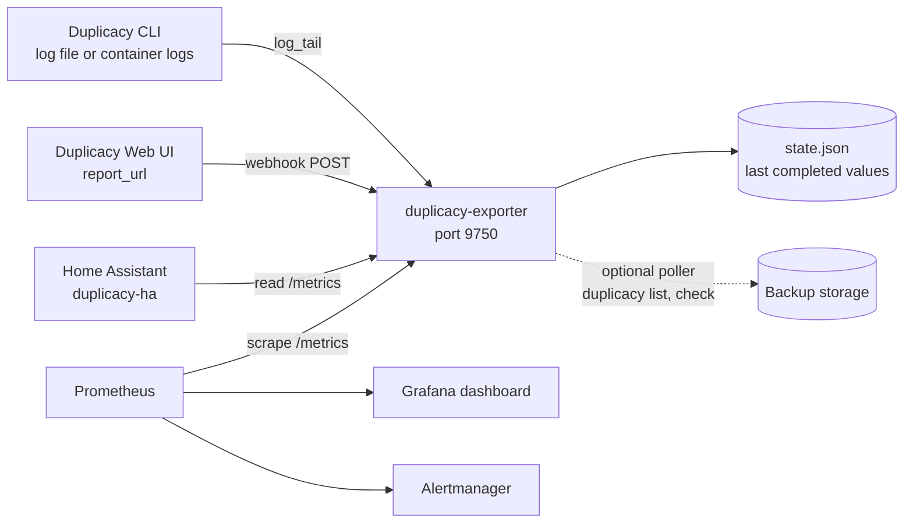

---
hide:
  - navigation
---

# duplicacy-exporter { .de-visually-hidden }

  

  
  
  
  

---

**duplicacy-exporter** turns [Duplicacy](https://duplicacy.com) backups into Prometheus metrics. It reads the CLI's log or receives the Web UI's report, and exposes progress and speed while a backup runs and the summary when it ends: duration, files, bytes uploaded, exit code and revision, per snapshot, storage and machine. Duplicacy on its own writes logs and sends email; nothing tells you that a backup failed last night or has not run for three days. With the exporter, Prometheus alerts on both, and the shipped Grafana dashboard shows every backup on every machine in one place. Start with [Getting started](getting-started.md), then [Prometheus and Grafana](prometheus-grafana.md).

-   :material-docker: **[Getting started](getting-started.md)**

    ---

    One compose file for the CLI (log tail) or the Web UI (webhook), or `pipx install duplicacy-exporter`.

-   :material-check-circle-outline: **[Check that it works](getting-started.md#check-that-it-works)**

    ---

    `/health` says `OK`, `/metrics` names the mode and version, and the first backup fills the series.

-   :material-chart-line: **[Prometheus and Grafana](prometheus-grafana.md)**

    ---

    The scrape job, two alert rules for a failed or stale backup, and the dashboard to import.

-   :material-format-list-bulleted: **[Metrics](metrics.md)**

    ---

    Every series, its type, its labels and where its value comes from.

## The dashboard

[Dashboard 25089](https://grafana.com/grafana/dashboards/25089) ships with the exporter. The top row is the state of each backup; the second row moves while one runs; the third is the last completed run; the fourth is the history. Filter by snapshot, storage target and machine.

<figure markdown>

<figcaption>Every run, over time</figcaption>
</figure>
<figure markdown>

<figcaption>A failed backup, alerted</figcaption>
</figure>

The raw series behind it are on `/metrics`:

## Which mode to use

| You run | Set | You get |
|---|---|---|
| Duplicacy CLI with [duplicacy-cli-cron](https://github.com/GeiserX/duplicacy-cli-cron), or any log with `--- Backup -> Primary (<id>) ---` headers | `MODE=log_tail` with `LOG_FILE` or `DOCKER_CONTAINER_NAME` | Live progress, speed and chunk counts, the post-run summary, prune timestamps |
| Duplicacy CLI with a plain `duplicacy backup` log | `MODE=log_tail` plus `SNAPSHOT_ID` and `MACHINE_NAME` | The post-run summary only; no moving gauge, because a plain log has no header that opens a run |
| Duplicacy Web UI | `MODE=webhook` and `report_url` pointed at the exporter | The post-run summary; no live values, because the Web UI reports only when a backup ends |

Storage size and revision counts are not in any log or report; the [storage poller](storage-poller.md) gets them by running the bundled duplicacy CLI, and it is off by default.

## How it runs

- One container, `drumsergio/duplicacy-exporter`, for amd64 and arm64, or the `duplicacy-exporter` package from PyPI. One Python file, one dependency.
- In `log_tail` mode it parses each line as Duplicacy prints it. In `webhook` mode it parses the JSON report the Web UI posts when a backup ends. See [How it works](how-it-works.md).
- The last completed values are saved to `STATE_FILE` and served again after a restart, so a dashboard or a Home Assistant sensor never goes blank on an upgrade. See [Persistence across restarts](configuration.md#persistence-across-restarts).
- Every setting is an environment variable. See [Configuration](configuration.md).

## What it does not do

- It does not run backups, and it never writes to your storage. The optional poller only reads it (`duplicacy list` and `duplicacy check`).
- It does not show live progress for the Web UI, or for a plain CLI log without section headers. See [Which mode to use](#which-mode-to-use).
- It does not record prune runs from the Web UI, and no mode reports storage size without the poller.
- It has no web page of its own beyond `/metrics` and `/health`; Grafana is the screen.

## Privacy

- The exporter reads a log file, a container's logs, or a POST from your Web UI. It makes no outbound request unless the poller is on, and then only to your own storage with credentials you mount.
- Storage URLs are reduced to a host label. `STORAGE_HOST_MAP` and `TAILSCALE_DOMAIN` turn addresses into names you choose, so an IP or a tailnet name need not appear in a dashboard.
- Metrics carry three labels: `snapshot_id`, `storage_target`, `machine`. File names never leave the log.

## Getting help

- If something is broken, read [Troubleshooting](troubleshooting.md), then open an [issue](https://github.com/GeiserX/duplicacy-exporter/issues) with the exporter's log at `LOG_LEVEL=DEBUG`.
- To report a security problem, follow the [security policy](https://github.com/GeiserX/duplicacy-exporter/blob/main/SECURITY.md) and do not open a public issue.
- The [releases page](https://github.com/GeiserX/duplicacy-exporter/releases) lists what changed between versions.
- The rest of the Duplicacy family (container image, cron wrapper, Home Assistant integration, MCP server) is on [Related projects](related.md).
- To send a fix, read [Development](development.md).

## License

duplicacy-exporter is released under the [GPL-3.0-or-later](https://github.com/GeiserX/duplicacy-exporter/blob/main/LICENSE) license. It is built on [prometheus_client](https://github.com/prometheus/client_python).
